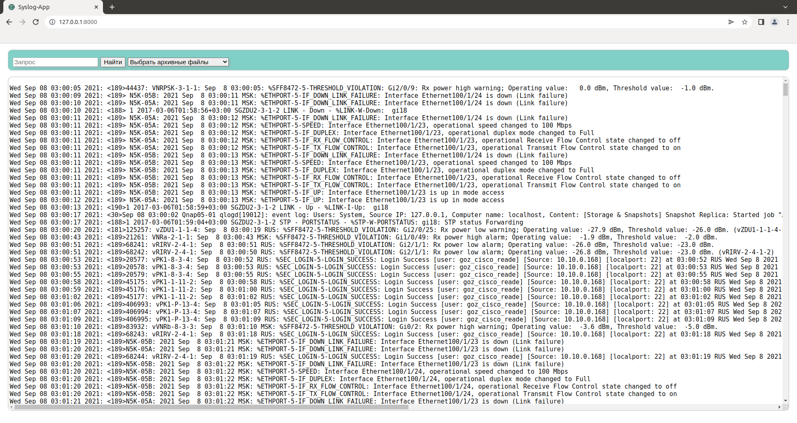
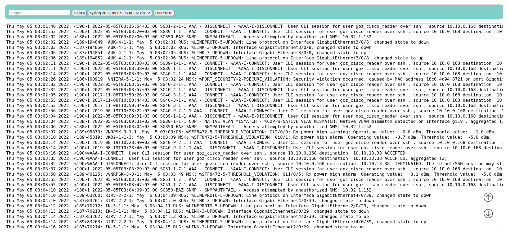
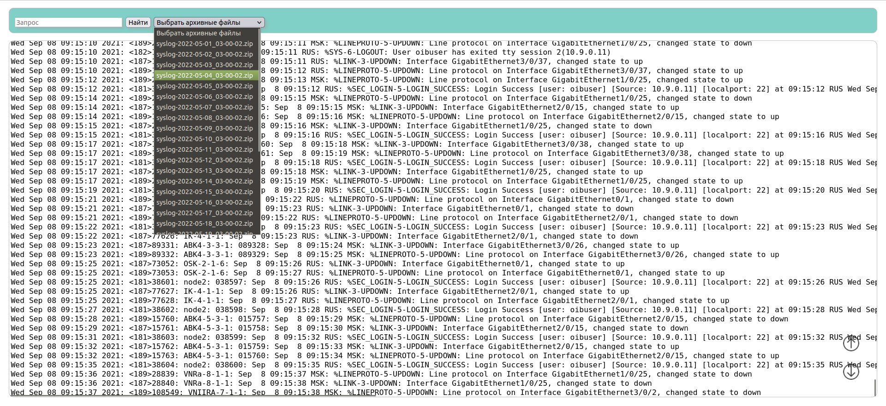
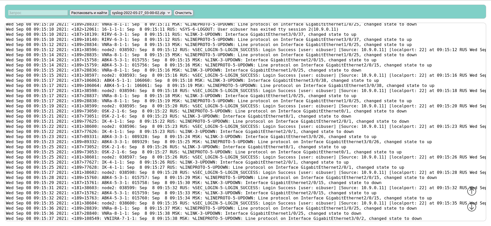

## Парсинг файла syslog.txt 
Все коммутаторы скидывают свои логи в файла syslog.txt, размер за сутки ~15mb.
Создаются резервные копии.
-   Используется фреймворк Django
-   Верстка CSS GRID
-   Java-script (ajax-запросы для получения данных (json), отрисовка web-контента, порционный вывод)
-   Распаковка резервных копий
-   Быстрый поиск нужных данных (модуль regex)

     

     

     

     

